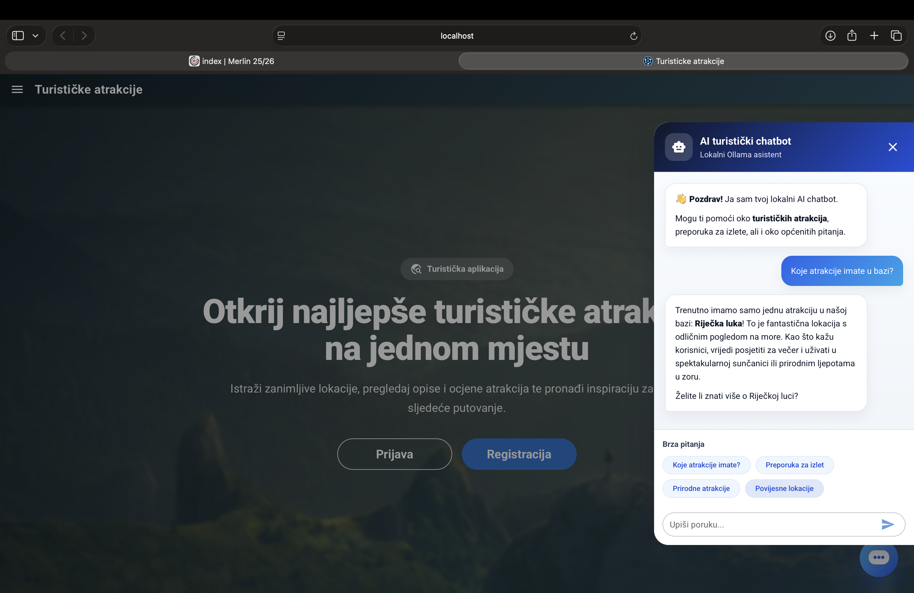

<p align="center">
  
</p>

<h1 align="center">Tourist attractions</h1>

<p align="center">
Full-stack web application for discovering, managing and interacting with tourist attractions, with AI chatbot integration.
</p>

<p align="center">
Armin Lišić · Ivan Gržetić
</p>

---

<h2 align="center">Overview</h2>

<p align="center">
  
</p>

<p align="center">
User Authentication • Attractions Management • MySQL Database • Interactive Maps • AI Chatbot
</p>

<p align="center">
Tourist Attractions is a full-stack application built with separated frontend and backend architecture.
</p>

---

<h2 align="center">Technology stack</h2>

<table align="center">
<tr>
<th>Frontend</th>
<th>Backend</th>
<th>AI / Development</th>
</tr>

<tr>
<td align="center">Vue 3</td>
<td align="center">Node.js</td>
<td align="center">Ollama</td>
</tr>

<tr>
<td align="center">Quasar framework</td>
<td align="center">Express</td>
<td align="center">SSE streaming</td>
</tr>

<tr>
<td align="center">Vue Router</td>
<td align="center">MySQL</td>
<td align="center">Nodemon</td>
</tr>

<tr>
<td align="center">Axios</td>
<td align="center">JWT authentication</td>
<td align="center">ESLint</td>
</tr>

<tr>
<td align="center">Leaflet</td>
<td align="center">bcryptjs</td>
<td align="center">Prettier</td>
</tr>

<tr>
<td align="center">Markdown-it</td>
<td align="center">Multer</td>
<td align="center">Vite</td>
</tr>

<tr>
<td align="center">Image compression</td>
<td align="center">CORS</td>
<td align="center">Git</td>
</tr>

</table>

---

<h2 align="center">Features</h2>

<table align="center">
<tr>
<th>Authentication</th>
<th>Attractions</th>
<th>AI / Interaction</th>
</tr>

<tr>
<td align="center">User login</td>
<td align="center">Add attractions</td>
<td align="center">AI Chatbot</td>
</tr>

<tr>
<td align="center">Registration</td>
<td align="center">Delete attractions</td>
<td align="center">Streaming responses</td>
</tr>

<tr>
<td align="center">JWT access</td>
<td align="center">User attractions</td>
<td align="center">Markdown support</td>
</tr>

<tr>
<td align="center">Role authorization</td>
<td align="center">Comments</td>
<td align="center">Map integration</td>
</tr>

<tr>
<td align="center">Session tokens</td>
<td align="center">Ratings</td>
<td align="center">Image upload</td>
</tr>

</table>

---

<h2 align="center">Project structure</h2>

<table align="center">
<tr>
<th>Folder</th>
<th>Purpose</th>
</tr>

<tr>
<td align="center">backend</td>
<td align="center">Express API and database logic</td>
</tr>

<tr>
<td align="center">turisticke</td>
<td align="center">Vue + Quasar frontend</td>
</tr>

<tr>
<td align="center">src</td>
<td align="center">Application source</td>
</tr>

<tr>
<td align="center">public</td>
<td align="center">Static assets</td>
</tr>

</table>

---

<h2 align="center">Requirements</h2>

<table align="center">
<tr>
<th>Software</th>
<th>Required</th>
<th>Version</th>
</tr>

<tr>
<td align="center">Node.js</td>
<td align="center">Yes</td>
<td align="center">18+</td>
</tr>

<tr>
<td align="center">npm</td>
<td align="center">Yes</td>
<td align="center">Latest</td>
</tr>

<tr>
<td align="center">MySQL</td>
<td align="center">Yes</td>
<td align="center">Stable</td>
</tr>

<tr>
<td align="center">Quasar CLI</td>
<td align="center">Yes</td>
<td align="center">Latest</td>
</tr>

<tr>
<td align="center">Ollama</td>
<td align="center">Chatbot</td>
<td align="center">Latest</td>
</tr>

</table>

Check versions:

```bash
node -v
npm -v
mysql --version
quasar -v
ollama --version
```

---

<details>
<summary><b>Installation instructions</b></summary>

### Clone

```bash
git clone <repository-url>
cd iooa-2026-turisticke-team_nexora
```

### Install backend

```bash
cd backend
npm install
```

### Install frontend

```bash
cd ../turisticke
npm install
```

### Install Quasar

```bash
npm install -g @quasar/cli
```

### Install Ollama

Download:

https://ollama.com/download

Verify:

```bash
ollama --version
```

Pull model:

```bash
ollama pull llama3
```

</details>

---

<details>
<summary><b>Database Setup</b></summary>

```sql
CREATE DATABASE turisticke;
```

Example:

```env
DB_HOST=localhost
DB_USER=root
DB_PASSWORD=your_password
DB_NAME=turisticke
```

</details>

---

<h2 align="center">Running the project</h2>

### Backend

```bash
cd backend
node index.js
```

### Frontend

```bash
cd turisticke
npx quasar dev
```

### Start Ollama

```bash
ollama serve
```

---

<h2 align="center">Start order</h2>

<table align="center">
<tr>
<th>Step</th>
<th>Service</th>
<th>Command</th>
</tr>

<tr>
<td align="center">1</td>
<td align="center">MySQL</td>
<td align="center">Start MySQL Server</td>
</tr>

<tr>
<td align="center">2</td>
<td align="center">Ollama</td>
<td align="center">ollama serve</td>
</tr>

<tr>
<td align="center">3</td>
<td align="center">Backend</td>
<td align="center">node index.js</td>
</tr>

<tr>
<td align="center">4</td>
<td align="center">Frontend</td>
<td align="center">npx quasar dev</td>
</tr>

</table>

---

<details>
<summary><b>Troubleshooting</b></summary>

```bash
npm install
npm install -g @quasar/cli
ollama serve
ollama list
```

</details>

---

<details>
<summary><b>Useful commands</b></summary>

<table align="center">
<tr>
<th>Purpose</th>
<th>Command</th>
</tr>

<tr>
<td align="center">Install packages</td>
<td align="center">npm install</td>
</tr>

<tr>
<td align="center">Dependencies</td>
<td align="center">npm list --depth=0</td>
</tr>

<tr>
<td align="center">Run frontend</td>
<td align="center">npx quasar dev</td>
</tr>

<tr>
<td align="center">Run backend</td>
<td align="center">node index.js</td>
</tr>

<tr>
<td align="center">Run Ollama</td>
<td align="center">ollama serve</td>
</tr>

</table>

</details>

---

<h2 align="center">Authors</h2>

<p align="center">
<strong>Armin Lišić</strong><br>
Ivan Gržetić
</p>